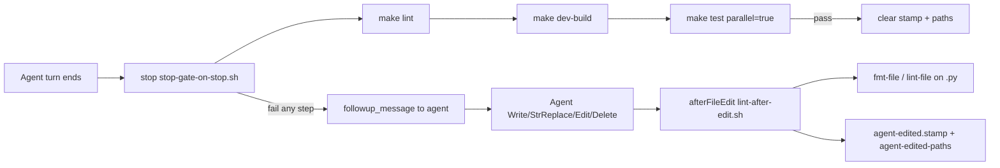

# Cursor hooks (lint + dev-build + test)

## Hooks
- Like a fence. Strict, and reliable.
- "Block that." "Check this." "Send an alert."
- They run by themselves. No thinking needed.

Agent edits trigger per-file format; handback runs one **stop gate** in strict order: lint → dev-build → tests. **Agents also run `make test parallel=true` in-turn before handback** (`.cursor/rules/agent-test-gate.mdc`) — the stop hook is backup, not a substitute. (`make test-agent-stop` remains a faster unit-only escape when E2E is not needed.)

| Hook | Event | Script | Job |
| --- | --- | --- | --- |
| **Format** | `afterFileEdit` | `lint-after-edit.sh` | `make fmt-file` / `make lint-file` on `.py` edits; stamp product-code edits + append path |
| **Stop gate** | `stop` | `stop-gate-on-stop.sh` | `make lint` → `make dev-build` → `make test parallel=true` |

Configured in `.cursor/hooks.json` — not agent instructions.

---

## Why one stop hook

Cursor runs **all** entries under `hooks.stop` **in parallel**. Three separate stop scripts raced: dev-build and tests saw missing phase stamps and **skipped**, while lint passed — handback succeeded with no rebuild and no tests.

**Fix:** single `stop-gate-on-stop.sh` runs every phase sequentially inside one process. Fail-fast via `followup_message` (repair loop, `loop_limit` in `hooks.json`).

---

## Information flow

C4: Component — Cursor hook scripts under `.cursor/hooks/`.

---

## Format hook (`lint-after-edit.sh`)

Runs on every agent `Write` / `StrReplace` / `Edit` / `Delete` of **product code** (not `.cursor/`, `docs/`, `*.md`, etc.).

1. **`.py`:** `make fmt-file` → `make lint-file` on the edited file (best-effort on failure; full gate is on `stop`).
2. **Stamp** — writes `.cursor/agent-edited.stamp` so the stop gate runs.
3. **Paths** — appends the repo-relative path to `.cursor/agent-edited-paths` for scoped `make dev-build`.

---

## Stop gate (`stop-gate-on-stop.sh`)

Skips when `status` is `aborted`, plan mode (`.cursor/plan-mode.stamp`), or no `agent-edited.stamp`.

1. **`make lint`**
2. **`make dev-build`** with `DEV_BUILD_PATHS_FILE=.cursor/agent-edited-paths` when non-empty — rebuilds images **and** force-recreates containers (`scripts/dev_build.sh`). Requires Docker (frontend image runs `npm run build` when frontend paths changed).
3. **`make test parallel=true`** — parallel backend pytest + frontend Vitest + Playwright E2E (full local suite). Needs a healthy Compose stack.

Writes `.cursor/stop-gate.lock` during the sequence so `scripts/e2e-kill.sh` does not kill test subprocesses.

On full success, clears stamps and paths. On failure, emits `followup_message` and keeps stamps for the repair loop.

**Virtualenv:** `hook_make` in `_common.sh` pins `UV_PROJECT_ENVIRONMENT` / `VIRTUAL_ENV` to `.venv/` (see `hook_venv_dir` in `_common.sh`).

**Verify:** **Output → Hooks** (live stdout/stderr). **Restart Cursor** after `hooks.json` changes.

---

## Timing vs chat UI

Cursor runs `stop` hooks **after** the agent turn completes. Expect a gap before lint/dev-build/tests start.

While the gate runs, **Output → Hooks** shows live stdout/stderr.

Chat updates only on failure (`Hooks blocked handback`). Success is silent in chat.

**Order:** `make lint` (~seconds) → `make dev-build` (~minutes when services changed) → `make test parallel=true` (tens of minutes with E2E).

---

## Not hooked (by design)

- **Tab completions** — agent hooks exclude `TabWrite`

---

## Debug

Scripts must be executable (`chmod +x .cursor/hooks/*.sh`). Restart Cursor if hooks do not load.

If handback looks done but tests fail manually, check **Output → Hooks** for a skipped gate (plan mode, read-only turn with no `agent-edited.stamp`, or aborted status).

---

## Local vs remote

**Single path** — Cursor IDE hooks on the developer laptop only. They rebuild/test the local Compose stack via Make; they do not run differently on AWS ECS.
